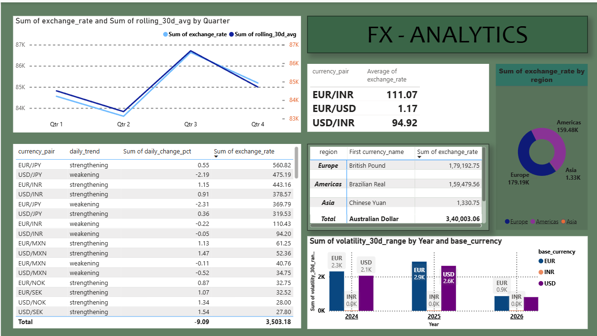

# FX Rate Analytics Engineering Pipeline

## Overview

End-to-end ELT pipeline ingesting live daily currency exchange rates from the Frankfurter ECB API into DuckDB, transforming through a three-layer dbt architecture, and serving business KPIs to a Power BI dashboard. Runs automatically every weekday at 08:00 UTC via Apache Airflow. Every code push is validated by a GitHub Actions CI/CD workflow.

## Dashboard Preview

## Architecture

    Frankfurter ECB API (free, no key needed)
             |
             v
    Python extract_daily.py  <-- Airflow triggers daily at 08:00 UTC
             |
             v
    DuckDB  raw.raw_fx_rates
             |
             v
    dbt staging    ->  stg_fx_rates (view)
             |
             v
    dbt intermediate  ->  int_fx_enriched (ephemeral, window functions)
             |
             v
    dbt marts  ->  fct_exchange_rates + dim_currencies + kpi_monthly_summary
             |
             v
    Power BI Dashboard (6 KPIs)

## Tech Stack

| Layer | Tool | Purpose |
|-------|------|---------|
| Extraction | Python + requests | Calls Frankfurter API daily |
| Warehouse | DuckDB | Local analytical data warehouse |
| Transformation | dbt Core | Three-layer ELT models |
| Orchestration | Apache Airflow | Daily scheduling and monitoring |
| CI/CD | GitHub Actions | Auto-tests on every push |
| Containerisation | Docker | Reproducible Airflow environment |
| Visualisation | Power BI | Business KPI dashboard |

## Data Model — Star Schema

- **fct_exchange_rates** — Fact table. One row per date/base/target currency. Contains rolling 7d and 30d averages, daily change %, trend direction, volatility range.
- **dim_currencies** — Currency dimension. Name, region, symbol.
- **kpi_monthly_summary** — Monthly aggregated KPIs per currency pair.

## Key Business KPIs

- EUR/INR, EUR/USD, USD/INR latest rates
- Daily movers ranked by change percentage
- Exchange rate trend with 30-day rolling average
- Monthly volatility by base currency
- Rate distribution by world region

## Data Quality

- 25+ dbt schema tests (unique, not_null, accepted_values)
- 2 custom SQL assertion tests
- All tests run automatically on every GitHub push via CI/CD

## Quick Start

Prerequisites: Python 3.11+, Docker Desktop, Git

**1. Clone and set up**

    git clone https://github.com/Ashief-VM/fx-analytics-pipeline.git
    cd fx-analytics-pipeline
    python -m venv venv
    venv\Scripts\activate
    pip install -r requirements.txt

**2. Load historical data**

    python ingestion/backfill_history.py

**3. Run dbt transformations**

    cd dbt_fx
    dbt build
    cd ..

**4. Start Airflow**

    docker-compose up -d

Open http://localhost:8080 with username admin and password admin. Enable the fx_daily_pipeline DAG.

**5. View dbt documentation and lineage**

    cd dbt_fx
    dbt docs generate
    dbt docs serve

Opens at http://localhost:8081

## Project Structure

    fx-analytics-pipeline/
    ├── .github/workflows/dbt_ci.yml     # CI/CD pipeline
    ├── airflow/dags/fx_pipeline_dag.py  # Daily Airflow schedule
    ├── ingestion/
    │   ├── backfill_history.py          # One-time historical load
    │   ├── extract_daily.py             # Daily API extract
    │   └── export_for_powerbi.py        # CSV export for Power BI
    ├── dbt_fx/
    │   ├── models/staging/              # stg_fx_rates.sql
    │   ├── models/intermediate/         # int_fx_enriched.sql
    │   ├── models/marts/                # fct_, dim_, kpi_ models
    │   ├── tests/                       # Custom SQL assertions
    │   └── seeds/currency_meta.csv      # Currency reference data
    ├── dashboards/
    │   ├── fx_dashboard.pbix            # Power BI dashboard
    │   └── dashboard_preview.png        # Dashboard screenshot
    ├── docker-compose.yml               # Airflow environment
    └── requirements.txt                 # Python dependencies

---
*Portfolio Project | Analytics Engineering | 2026*